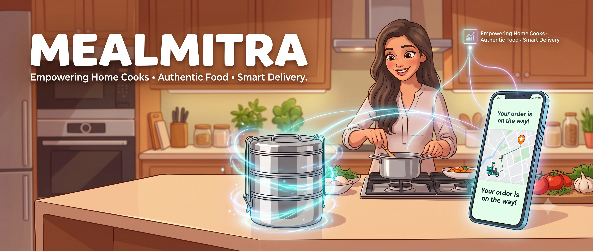

<!-- 
=========================================================
🎀 WELCOME TO YOUR CUTE & GIRLY PROFILE README! 🎀
=========================================================
⚠️ CRITICAL FOR YOUR GITHUB STREAK TO WORK:
You MUST replace EVERY instance of "YOUR_GITHUB_USERNAME_HERE" 
with your ACTUAL GitHub username (the one in your profile URL).
If you do not change it, the streak and stats will not load!
=========================================================
-->

  
  

  # ✨ Hi, I'm Vaidehi Pandya ✨
  
 

  

    I’m a B.Tech IT student who loves turning ideas into practical, beautiful web applications! 🌷  
    I’m currently learning MERN Stack development while exploring Python,  
    data analysis, and visualization to build real-world projects. 💖
  

 

  

## 👩‍💻 About Me 🎀

*   🎓 **B.Tech IT student** building a strong foundation in modern technology!
*   💻 Learning **MERN Stack development** by building practical, hands-on web applications.
*   📊 Also interested in **Data Analytics** and creating pretty, insightful data dashboards!
*   🛠️ I absolutely love working on projects that solve **real problems**.
*   🚀 Currently improving my full-stack development skills through continuous learning.

  

## 🍱 Featured Project: MealMitra ✨

> **Smart Tiffin Service Management & Customer Engagement Platform**

  <!-- REPLACE THE URL BELOW WITH YOUR MEALMITRA PROJECT BANNER -->
  

  <!-- REPLACE PLACEHOLDERS WITH ACTUAL LINKS -->
  
  

 

**MealMitra** is a homemade food and tiffin service platform designed to connect customers with amazing home chefs and delivery partners. It is strictly focused on authentic homemade meals, tiffin subscriptions, and one-time meal bookings! 🥘

### 🔐 Authentication Flow 🌸
*   **Role Selection:** Users pick their role: Customer, Chef, or Delivery Partner.
*   **Phone Setup:** Phone numbers are stored securely during registration.
*   **OTP Magic:** Users log in using simple OTP-based authentication (no messy passwords!).
*   **Access Control:** Role-based access ensures everyone only sees the dashboards meant for them.

### 🌟 Key Features 💖
*   Homemade food discovery & chef profiles.
*   Meal/menu management & date-based meal slots.
*   Subscription-based tiffin service & advance bookings.
*   Secure OTP-based authentication & online payments.
*   Live notifications & location-based distance calculation.
*   Business analytics & clean data dashboards.

### ⚙️ System Flow 🎀

<table align="center">
  <tr>
    <td align="center" width="33%" valign="top">
      <b>👤 CUSTOMER FLOW</b>  
      Register / Login with OTP ⬇️ 
      Browse Homemade Meals ⬇️ 
      Choose Chef ⬇️ 
      Select Meal / Subscription ⬇️ 
      Payment ⬇️ 
      Order Confirmation ⬇️ 
      Delivery Tracking ⬇️ 
      Meal Delivered! ✨
    </td>
    <td align="center" width="33%" valign="top">
      <b>🧑‍🍳 CHEF FLOW</b>  
      Register ⬇️ 
      Create Profile ⬇️ 
      Add Menu ⬇️ 
      Set Meal Slots ⬇️ 
      Manage Orders ⬇️ 
      Prepare Meal! 🥘
    </td>
    <td align="center" width="33%" valign="top">
      <b>🛵 DELIVERY FLOW</b>  
      Register ⬇️ 
      Receive Assigned Delivery ⬇️ 
      Navigate to Pickup ⬇️ 
      Deliver Meal ⬇️ 
      Update Delivery Status! 🚀
    </td>
  </tr>
</table>

### 🛠️ Tech Stack: MealMitra 🌷

  
  
  
  
  
   
  
  
  
  
   
  
  
  

  

## 💰 Featured Project: SpendLens ✨

> **Personal Finance Analyzer**
**SpendLens** is a personal finance analysis tool that helps users understand spending patterns from bank statements and raw transaction data! 💸

### 🔍 Overview & My Role 🎀
*   **Role:** Data Analyst & CSV/PDF Parser 
*   **Supported Formats:** CSV, PDF, JSON 
*   **Workflow:** Parse statements ➡️ Clean data ➡️ Extract fields ➡️ Categorize transactions ➡️ Visualize trends!
*   **Dataset & Insights:** Built using `bank_statement_1000.csv` to track total spending, monthly trends, and largest categories.

### 🛠️ Tech Stack: SpendLens 🌷

  
  
  
  
   
  <code>pdfplumber</code> • <code>Camelot</code> • <code>Data Cleaning</code> • <code>Data Analysis</code>

  

## 🚀 Tech Stack & Skills 💖

**🌐 Languages**
 

  

**💻 Web Development**
 

  

**📊 Data & Analytics**
 

  

**🗄️ Database & Tools**
 

  

## 🌱 Currently Exploring 🌷

  <code>MERN Stack</code> 🌸 <code>Full-Stack Web Dev</code> 🌸 <code>REST APIs</code> 
  <code>Authentication</code> 🌸 <code>MongoDB</code> 🌸 <code>Data Analytics</code> 
  <code>Data Visualization</code> 🌸 <code>Production Deployments</code>

 

  

## 📈 GitHub Statistics ✨

<!-- 
🚨 IMPORTANT: Replace YOUR_GITHUB_USERNAME_HERE with your exact GitHub Username! 🚨 
If you do not change it, the streak and stats will not show your actual data.
-->

  
  
  

  

  

## 📂 What I'm Building 🎀

*   🍱 **MealMitra** — Smart homemade food and tiffin service platform.
*   💰 **SpendLens** — Personal finance analyzer.

  

## 📬 Let's Connect! 💖

<!-- REPLACE THE HREF LINKS WITH YOUR ACTUAL PROFILES/EMAILS -->

  

 

<i>Building the future, beautifully! ✨</i>

